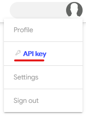

# virustotal-python 🐍


[](https://github.com/dbrennand/virustotal-python/actions/workflows/ci.yml)
[](https://github.com/dbrennand/virustotal-python/actions/workflows/publish.yml)

A Python library to interact with the public VirusTotal v3 and v2 APIs.

> This library is intended to be used with the public VirusTotal APIs. However, it *could* be used to interact with premium API endpoints as well.
>
> It is highly recommended that you use the VirusTotal v3 API as it is the "default and encouraged way to programmatically interact with VirusTotal".

## Installation 🛠

```bash
# PyPi
pip install virustotal-python
# Manually
pip install .
# Poetry
poetry install --no-dev
```

## Get a VirusTotal API Key 🔑

[Sign up](https://www.virustotal.com/gui/join-us) for a VirusTotal account. Then, view your VirusTotal API key.



## Getting Started

```python
import virustotal_python

with virustotal_python.Virustotal("<VirusTotal API Key>") as vtotal:
    # Your code here...

# Use the (old) VirusTotal version 2 API
with virustotal_python.Virustotal(
    API_KEY="<VirusTotal API Key>", API_VERSION=2
) as vtotal:
    # Your code here...

# You can also set proxies and timeouts for requests made by the library
# NOTE: To use proxies, you must have the PySocks extra installed
with virustotal_python.Virustotal(
    API_KEY="<VirusTotal API Key>",
    PROXIES={"http": "http://10.10.1.10:3128", "https": "https://10.10.1.10:1080"},
    TIMEOUT=5.0,
) as vtotal:
    # Your code here...

# You can also omit the API_KEY parameter and provide your
# API key via the environment variable VIRUSTOTAL_API_KEY
# Bash: export VIRUSTOTAL_API_KEY="<VirusTotal API Key>"
# PowerShell: $Env:VIRUSTOTAL_API_KEY = "<VirusTotal API Key>"
# Then...
with virustotal_python.Virustotal() as vtotal:
    # Your code here...
```

## Code Snippets

> Further usage examples can be found in [examples](examples).

### Send a file for analysis 🔎

```python
import virustotal_python
import os.path
from pprint import pprint

FILE_PATH = "/path/to/file/to/scan.txt"

# Create dictionary containing the file to send for multipart encoding upload
files = {"file": (os.path.basename(FILE_PATH), open(os.path.abspath(FILE_PATH), "rb"))}

with virustotal_python.Virustotal("<VirusTotal API Key>") as vtotal:
    resp = vtotal.request("files", files=files, method="POST")
    pprint(resp.json())
```

### Get information about a file 📁

```python
import virustotal_python
from pprint import pprint

# The ID (either SHA-256, SHA-1 or MD5 hash) identifying the file
FILE_ID = "9f101483662fc071b7c10f81c64bb34491ca4a877191d464ff46fd94c7247115"

with virustotal_python.Virustotal("<VirusTotal API Key>") as vtotal:
    resp = vtotal.request(f"files/{FILE_ID}")
    pprint(resp.data)
```

### Send a URL 🔗 for analysis and get the report 📄

```python
import virustotal_python
from pprint import pprint
from base64 import urlsafe_b64encode

url = "ihaveaproblem.info"

with virustotal_python.Virustotal("<VirusTotal API Key>") as vtotal:
    try:
        resp = vtotal.request("urls", data={"url": url}, method="POST")
        # Safe encode URL in base64 format
        # https://developers.virustotal.com/reference/url
        url_id = urlsafe_b64encode(url.encode()).decode().strip("=")
        report = vtotal.request(f"urls/{url_id}")
        pprint(report.object_type)
        pprint(report.data)
    except virustotal_python.VirustotalError as err:
        print(f"Failed to send URL: {url} for analysis and get the report: {err}")
```

### Get information about a domain:

```python
import virustotal_python
from pprint import pprint

domain = "virustotal.com"

with virustotal_python.Virustotal("<VirusTotal API Key>") as vtotal:
    resp = vtotal.request(f"domains/{domain}")
    pprint(resp.data)
```

## Development

[Black](https://github.com/psf/black) is used for code formatting.

### Unit Tests

Install the development dependencies using Poetry:

```bash
poetry install && poetry shell
```

To run the unit tests, run `pytest` from the root of the project:

```bash
pytest --cov=virustotal_python
```

### Publishing a new release

```bash
# Run from the master branch
export VERSION=x.x.x
git commit --allow-empty -m "Publish $VERSION"
git tag -a $VERSION -m "Version $VERSION"
git push --tags
```

## Authors & Contributors

* [**dbrennand**](https://github.com/dbrennand) - *Author*

* [**smk762**](https://github.com/smk762) - *Contributor*

## Changelog

See the [CHANGELOG](CHANGELOG.md) for details.

## License
This project is licensed under the MIT License - see the [LICENSE](LICENSE) for details.
